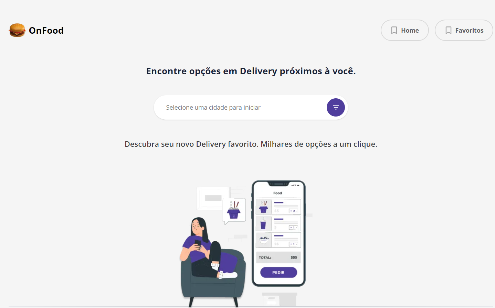
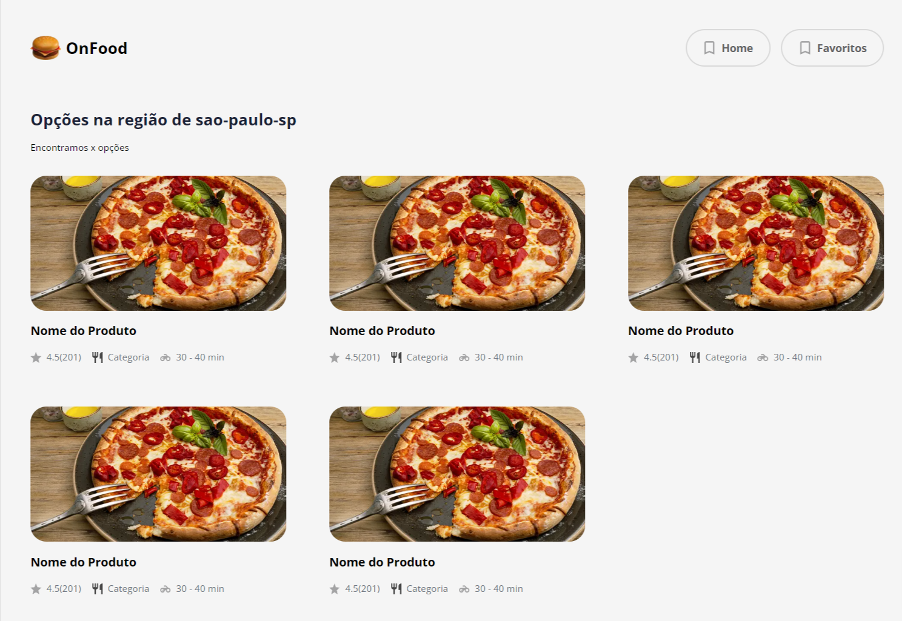

## Resumo e descrição do projeto

Conteúdo desenvolvido pelo Imersão FrontExpert, onde foi passado algumas dicas e configurações de organização e gestão de conteúdos pelo Tailwindcss.<br/>

## Fotos

 
 | 
| :---: | :---: |
## Projeto Figma
https://www.figma.com/file/WQQusGr055AVs3lQ8M6TU0/OnFoodIFX?node-id=6%3A6558
### Tecnologias

Este projeto foi feito utilizando as seguintes tecnologias:

- [React](https://reactjs.org/)
- [Typescript](https://www.typescriptlang.org/)
- [NextJS](https://nextjs.org/)
- [Tailwind CSS ](https://tailwindcss.com/)
- [HeadlessUI](https://headlessui.dev/react/menu)
- [React Query](https://react-query.tanstack.com/)


### Tutorial de instalação

Clone o projeto

```term

git@github.com:moraes3000/next-front-on-food.git
```

Instale as dependências

```term

yarn

```

Rode o projeto

```term

yarn dev

```

Acesse [http://localhost:3000](http://localhost:3000/) para ver o resultado.